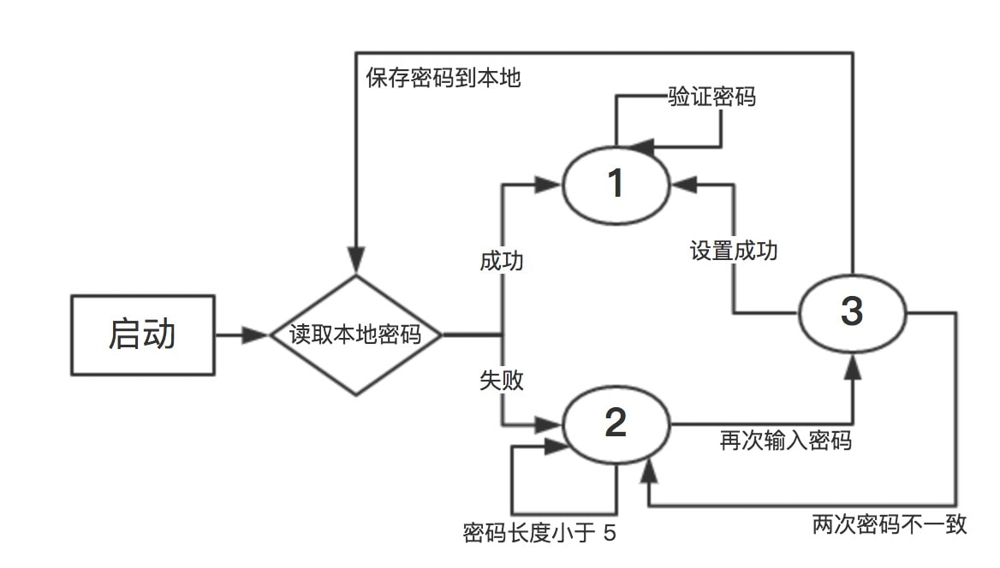

## H5 手势解锁

扫描在线查看：


首先，我要说明一下，对于这个项目，我是参考别人的，[H5lock](https://github.com/lvming6816077/H5lock)。

我觉得一个比较合理的解法应该是利用 canvas 来实现，不知道有没有大神用 css 来实现。如果纯用 css 的话，可以将连线先设置 `display: none`，当手指划过的时候，显示出来。光设置这些应该就非常麻烦吧。

之前了解过 canvas，但没有真正的写过，下面就来介绍我这几学习 canvas 并实现 H5 手势解锁的过程。

## 准备及布局设置

我这里用了一个比较常规的做法：

```javascript
(function(w){
  var handLock = function(option){}

  handLock.prototype = {
    init : function(){},
    ...
  }

  w.handLock = handLock;
})(window)

new handLock({
  el: document.getElementById('id'),
  ...
}).init();
```

传入的参数中要包含一个 dom 对象，会在这个 dom 对象內创建一个 canvas。

关于 css 的话，懒得去新建文件了，就直接內联了。

## canvas

### 1. 学习 canvas 并搞定画圆

MDN 上面有个简易的教程，大致浏览了一下，感觉还行。[Canvas教程](https://developer.mozilla.org/zh-CN/docs/Web/API/Canvas_API/Tutorial)。

先创建一个 `canvas`，然后设置其大小，并通过 `getContext` 方法获得绘画的上下文：

```javascript
var canvas = document.createElement('canvas');
canvas.width = canvas.height = width;
this.el.appendChild(canvas);

this.ctx = canvas.getContext('2d');
```

然后呢，先画 `n*n` 个圆出来：

```javascript
createCircles: function(){
  var ctx = this.ctx,
    drawCircle = this.drawCircle,
    n = this.n;
  this.r = ctx.canvas.width / (2 + 4 * n) // 这里是参考的，感觉这种画圆的方式挺合理的，方方圆圆
  r = this.r;
  this.circles = []; // 用来存储圆心的位置
  for(var i = 0; i < n; i++){
    for(var j = 0; j < n; j++){
      var p = {
        x: j * 4 * r + 3 * r,
        y: i * 4 * r + 3 * r,
        id: i * 3 + j
      }
      this.circles.push(p);
    }
  }
  ctx.clearRect(0, 0, ctx.canvas.width, ctx.canvas.height); // 为了防止重复画
  this.circles.forEach(function(v){
    drawCircle(ctx, v.x, v.y); // 画每个圆
  })
},

drawCircle: function(ctx, x, y){ // 画圆函数
  ctx.strokeStyle = '#FFFFFF';
  ctx.lineWidth = 2;
  ctx.beginPath();
  ctx.arc(x, y, this.r, 0, Math.PI * 2, true);
  ctx.closePath();
  ctx.stroke();
}
```

画圆函数，需要注意：如何确定圆的半径和每个圆的圆心坐标（这个我是参考的），如果以圆心为中点，每个圆上下左右各扩展一个半径的距离，同时为了防止四边太挤，四周在填充一个半径的距离。那么得到的半径就是 `width / ( 4 * n + 2)`，对应也可以算出每个圆所在的圆心坐标，**GET**。

### 2. 画线

画线需要借助 touch event 来完成，也就是，当我们 `touchstart` 的时候，传入开始时的相对坐标，作为线的一端，当我们 `touchmove` 的时候，获得坐标，作为线的另一端，当我们 `touchend` 的时候，开始画线。

这只是一个测试画线功能，具体的后面再进行修改。

有两个函数，获得当前 touch 的相对坐标：

```javascript
getTouchPos: function(e){ // 获得触摸点的相对位置
  var rect = e.target.getBoundingClientRect();
  var p = { // 相对坐标
    x: e.touches[0].clientX - rect.left,
    y: e.touches[0].clientY - rect.top
  };
  return p;
}
```

画线：

```javascript
drawLine: function(p1, p2){ // 画线
  this.ctx.beginPath();
  this.ctx.lineWidth = 3;
  this.ctx.moveTo(p1.x, p2.y);
  this.ctx.lineTo(p.x, p.y);
  this.ctx.stroke();
  this.ctx.closePath();
},
```

然后就是监听 canvas 的 `touchstart`、`touchmove`、和 `touchend` 事件了。

### 3. 画折线

所谓的画折线，就是，将已经触摸到的点连起来，可以把它看作是画折线。

首先，要用两个数组，一个数组用于已经 touch 过的点，另一个数组用于存储未 touch 的点，然后在 move 监听时候，对 touch 的相对位置进行判断，如果触到点，就把该点从未 touch 移到 touch 中，然后，画折线，思路也很简单。

```javascript
drawLine: function(p){ // 画折线
  this.ctx.beginPath();
  this.ctx.lineWidth = 3;
  this.ctx.moveTo(this.touchCircles[0].x, this.touchCircles[0].y);
  for (var i = 1 ; i < this.touchCircles.length ; i++) {
    this.ctx.lineTo(this.touchCircles[i].x, this.touchCircles[i].y);
  }
  this.ctx.lineTo(p.x, p.y);
  this.ctx.stroke();
  this.ctx.closePath();
},
```

```javascript
judgePos: function(p){ // 判断 触点 是否在 circle 內
  for(var i = 0; i < this.restCircles.length; i++){
    temp = this.restCircles[i];
    if(Math.abs(p.x - temp.x) < r && Math.abs(p.y - temp.y) < r){
      this.touchCircles.push(temp);
      this.restCircles.splice(i, 1);
      this.touchFlag = true;
      break;
    }
  }
}
```

### 4. 标记已画

前面已经说了，我们把已经 touch 的点（圆）放到数组中，这个时候需要将这些已经 touch 的点给标记一下，在圆心处画一个小实心圆：

```javascript
drawPoints: function(){
  for (var i = 0 ; i < this.touchCircles.length ; i++) {
    this.ctx.fillStyle = '#FFFFFF';
    this.ctx.beginPath();
    this.ctx.arc(this.touchCircles[i].x, this.touchCircles[i].y, this.r / 2, 0, Math.PI * 2, true);
    this.ctx.closePath();
    this.ctx.fill();
  }
}
```

同时添加一个 reset 函数，当 touchend 的时候调用，400ms 调用 reset 重置 canvas。

到现在为止，一个 H5 手势解锁的简易版已经基本完成。

## password

为了要实现记住和重置密码的功能，把 password 保存在 localStorage 中，但首先要添加必要的 html 和样式。

### 1. 添加 message 和 单选框

为了尽可能的使界面简洁（越丑越好），直接在 body 后面添加了：

```html
<div id="select">
  <div class="message">请输入手势密码</div>
  <div class="radio">
    <label><input type="radio" name="pass">设置手势密码</label>
    <label><input type="radio" name="pass">验证手势密码</label>
  </div>
</div>
```

将添加到 dom 已 option 的形式传给 handLock：

```javascript
var el = document.getElementById('handlock'),
  info = el.getElementsByClassName('info')[0],
  select = document.getElementById('select'),
  message = select.getElementsByClassName('message')[0],
  radio = select.getElementsByClassName('radio')[0],
  setPass = radio.children[0].children[0],
  checkPass = radio.children[1].children[0];
var h = new handLock({
  el: el,
  info: info,
  message: message,
  setPass: setPass,
  checkPass: checkPass,
  n: 3
});
h.init();
```

### 2. info 信息显示

关于 info 信息显示，自己写了一个悬浮窗，然后默认为 `display: none`，然后写了一个 `showInfo` 函数用来显示提示信息，直接调用：

```javascript
showInfo: function(message, timer){ // 专门用来显示 info
  var info = this.dom.info;
  info.innerHTML = message;
  info.style.display = 'block';
  setTimeout(function(){
    info.style.display = '';
  }, 1000)
}
```

关于 info 的样式，在 html 中呢。

### 3. 关于密码

先不考虑从 localStorage 读取到情况，新加一个 lsPass 对象，专门用于存储密码，由于密码情况比较多，比如设置密码，二次确认密码，验证密码，为了方便管理，暂时设置了密码的三种模式，分别是：

>model：1 验证密码模式

>model：2 设置密码模式

>model：3 设置密码二次验证

具体看下面这个图：



这三种 model ，只要处理好它们之间如何跳转就 ok 了。

所以就有了 initPass：

```javascript
initPass: function(){ // 将密码初始化
  this.lsPass = w.localStorage.getItem('HandLockPass') ? {
    model: 1,
    pass: w.localStorage.getItem('HandLockPass').split('-')
  } : { model: 2 };
  this.updateMessage();
},

updateMessage: function(){ // 根据当前模式，更新 dom
  if(this.lsPass.model == 2){
    this.dom.setPass.checked = true;
    this.dom.message.innerHTML = '请设置手势密码';
  }else if(this.lsPass.model == 1){
    this.dom.checkPass.checked = true;
    this.dom.message.innerHTML = '请验证手势密码';
  }else if(this.lsPass.model = 3){
    this.dom.setPass.checked = true;
    this.dom.message.innerHTML = '请再次输入密码';
  }
},
```

有必要再来介绍一下 lsPass 的格式：

```javascript
this.lsPass = {
  model：1, // 表示当前的模式
  pass: [0, 1, 2, 4, 5] // 表示当前的密码，可能不存在
}
```

因为之前已经有了一个基本的实现框架，现在只需要在 touchend 之后，写一个函数，功能就是先对当前的 model 进行判断，实现对应的功能，这里要用到 touchCircles 数组，表示密码的顺序：

```javascript
checkPass: function(){
  var succ, model = this.lsPass.model; //succ 以后会用到
  if(model == 2){ // 设置密码
    if(this.touchCircles.length < 5){ // 验证密码长度
      succ = false;
      this.showInfo('密码长度至少为 5！', 1000);
    }else{
      succ = true;
      this.lsPass.temp = []; // 将密码放到临时区存储
      for(var i = 0; i < this.touchCircles.length; i++){
        this.lsPass.temp.push(this.touchCircles[i].id);
      }
      this.lsPass.model = 3;
      this.showInfo('请再次输入密码', 1000);
      this.updateMessage();
    }
  }else if(model == 3){// 确认密码
    var flag = true;
    // 先要验证密码是否正确
    if(this.touchCircles.length == this.lsPass.temp.length){
      var tc = this.touchCircles, lt = this.lsPass.temp;
      for(var i = 0; i < tc.length; i++){
        if(tc[i].id != lt[i]){
          flag = false;
        }
      }
    }else{
      flag = false;
    }
    if(!flag){
      succ = false;
      this.showInfo('两次密码不一致，请重新输入', 1000);
      this.lsPass.model = 2; // 由于密码不正确，重新回到 model 2
      this.updateMessage();
    }else{
      succ = true; // 密码正确，localStorage 存储，并设置状态为 model 1
      w.localStorage.setItem('HandLockPass', this.lsPass.temp.join('-')); // 存储字符串
      this.lsPass.model = 1; 
      this.lsPass.pass = this.lsPass.temp;
      this.updateMessage();
    }
    delete this.lsPass.temp; // 很重要，一定要删掉，bug
  }else if(model == 1){ // 验证密码
    var tc = this.touchCircles, lp = this.lsPass.pass, flag = true;
    if(tc.length == lp.length){
      for(var i = 0; i < tc.length; i++){
        if(tc[i].id != lp[i]){
          flag = false;
        }
      }
    }else{
      flag = false;
    }
    if(!flag){
      succ = false;
      this.showInfo('很遗憾，密码错误', 1000);
    }else{
      succ = true;
      this.showInfo('恭喜你，验证通过', 1000);
    }
  }
},
```

密码的设置要参考前面那张图，要时刻警惕状态的改变。

### 4. 手动重置密码

思路也很简单，就是添加点击事件，点击之后，改变 model 即可，点击事件如下：

```javascript
this.dom.setPass.addEventListener('click', function(e){
  self.lsPass.model = 2; // 改变 model 为设置密码
  self.updateMessage(); // 更新 message
  self.showInfo('请设置密码', 1000);
})
this.dom.checkPass.addEventListener('click', function(e){
  if(self.lsPass.pass){
    self.lsPass.model = 1;
    self.updateMessage();
    self.showInfo('请验证密码', 1000)
  }else{
    self.showInfo('请先设置密码', 1000);
    self.updateMessage();
  }
})
```

**ps：这里面还有几个小的 bug**，因为 model 只有 3 个，所以设置的时候，当点击重置密码的时候，没有设置密码成功，又切成验证密码状态，此时无法提升沿用旧密码，原因是 **model 只有三个**。

### 5. 添加 touchend 颜色变化

实现这个基本上就大功告成了，这个功能最主要的是给用户一个提醒，若用户划出的密码符合规范，显示绿色，若不符合规范或错误，显示红色警告。

因为之前已经设置了一个 succ 变量，专门用于重绘。

```javascript
drawEndCircles: function(color){ // end 时重绘已经 touch 的圆
  for(var i = 0; i < this.touchCircles.length; i++){
    this.drawCircle(this.touchCircles[i].x, this.touchCircles[i].y, color);
  }
},

// 调用
if(succ){
  this.drawEndCircles('#2CFF26');
}else{
  this.drawEndCircles('red');
}
```

那么，一个可以演示的版本就生成了，尽管还存在一些 bug，随后会来解决。（详情分支 password）

## 一些 bugs

有些 bugs 在做的时候就发现了，一些 bug 后来用手机测试的时候才发现，比如，我用 chrome 的时候，没有察觉这个 bug，当我用 android 手机 chrome 浏览器测试的时候，发现当我 touchmove 向下的时候，会触发浏览器的下拉刷新，解决办法：加了一个 `preventDefault`，没想到居然成功了。

```javascript
this.canvas.addEventListener('touchmove', function(e){
  e.preventDefault ? e.preventDefault() : null;
  var p = self.getTouchPos(e);
  if(self.touchFlag){
    self.update(p);
  }else{
    self.judgePos(p);
  }
}, false)
```

## 参考

>[H5lock](https://github.com/lvming6816077/H5lock)

>[Canvas教程](https://developer.mozilla.org/zh-CN/docs/Web/API/Canvas_API/Tutorial)

>[js获取单选框里面的值](http://www.cnblogs.com/wangkongming/archive/2013/08/30/3291081.html)